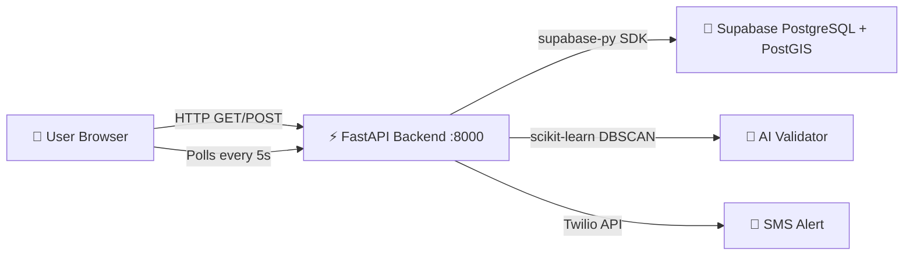

# RoadPulse — Complete Code Explanation

---

## 1. High-Level Architecture



**Three layers:**

| Layer | Tech | Role |
|-------|------|------|
| **Frontend** | React 18 + Vite + Leaflet + Tailwind | The map UI the user sees |
| **Backend** | Python FastAPI + Uvicorn | REST API that processes reports and serves pothole data |
| **Database** | Supabase (PostgreSQL + PostGIS) | Stores all potholes and raw reports with geospatial queries |

---

## 2. Complete Data Flow

### Flow 1: Loading the Map (GET /potholes)

```
Browser loads → App.jsx renders → usePotholes hook starts
    ↓
Every 5 seconds: GET http://localhost:8000/potholes
    ↓
FastAPI main.py → calls db_client.get_all_potholes()
    ↓
db_client queries Supabase: SELECT * FROM potholes WHERE status='open' ORDER BY severity DESC
    ↓
Returns JSON array of potholes → frontend receives it
    ↓
MapView.jsx renders a CircleMarker for each pothole
Dashboard.jsx calculates stats (count, critical, health score, etc.)
```

### Flow 2: Reporting a Pothole (POST /report)

```
User clicks "Simulate Bump" → ReportButton.jsx calls useSimulator
    ↓
POST http://localhost:8000/report
Body: { lat, lng, severity_raw, speed_kmh, device_id }
    ↓
FastAPI main.py /report endpoint:
  1. Validates input with Pydantic (models.py)
  2. Calls db_client.insert_raw_report() → INSERT INTO raw_reports
  3. Calls db_client.get_nearby_raw_reports() → Supabase RPC get_nearby_reports
     (finds all reports within 5m radius in last 7 days using PostGIS ST_DWithin)
  4. Calls ai_validator.validate_pothole(nearby_reports)
     → Runs DBSCAN clustering on the lat/lng coordinates
     → If cluster has ≥ 3 points → CONFIRMED
  5. If confirmed:
     → db_client.upsert_pothole() (creates new or merges with existing within 5m)
     → If severity ≥ 7.0: alerts.send_alert() (Twilio SMS)
  6. Returns response: { pothole_confirmed: true/false, severity, confidence }
    ↓
Frontend shows toast notification
Next 5s poll picks up the new pothole → appears on map
```

---

## 3. Backend — File by File

### [main.py](file:///c:/Users/Lenovo/OneDrive/Desktop/RoadPulse.ai/backend/main.py) — The API Server

This is the FastAPI application entry point. It defines 4 endpoints:

| Endpoint | Method | What it does |
|----------|--------|-------------|
| `/health` | GET | Returns `{"status": "ok"}` — used to check if server is alive |
| `/potholes` | GET | Returns all open potholes from Supabase, sorted by severity DESC |
| `/report` | POST | Accepts a raw bump report, runs AI validation, optionally creates pothole |
| `/pothole/{id}/fix` | POST | Marks a pothole as "fixed" in the database |

**Key code in `/report`:**
```python
# 1. Insert the raw report
report_id = db_client.insert_raw_report(lat, lng, severity_raw, speed_kmh, device_id)

# 2. Get nearby reports (PostGIS spatial query)
nearby = db_client.get_nearby_raw_reports(lat, lng, radius_metres=5.0, days=7)

# 3. Run DBSCAN AI validation
result = ai_validator.validate_pothole(nearby)

# 4. If confirmed, create/merge pothole
if result["confirmed"]:
    pothole_id = db_client.upsert_pothole(lat, lng, result["severity"])
    # 5. Send SMS if critical
    if result["severity"] >= 7.0:
        alerts.send_alert(...)
```

**CORS:** Configured to allow `*` (all origins) so the frontend on any port can call it.

---

### [models.py](file:///c:/Users/Lenovo/OneDrive/Desktop/RoadPulse.ai/backend/models.py) — Pydantic Schemas

Defines the shape of request/response data with **automatic validation**:

```python
class RawReportRequest(BaseModel):
    lat: float       # Must be -90 to 90
    lng: float       # Must be -180 to 180
    severity_raw: float  # Must be 0 to 10
    speed_kmh: float     # Must be 0 to 200
    device_id: str       # Any string
```

If someone sends `lat: 999`, FastAPI will automatically return a `422 Validation Error` — the endpoint code never even runs.

---

### [db_client.py](file:///c:/Users/Lenovo/OneDrive/Desktop/RoadPulse.ai/backend/db_client.py) — Database Layer

**This is the ONLY file that talks to Supabase.** No other file makes database calls.

Key functions:

| Function | What it does |
|----------|-------------|
| `_get_client()` | Lazy-initializes the Supabase client using URL + Key from `.env` |
| `get_all_potholes()` | `SELECT * FROM potholes WHERE status='open'` |
| `get_pothole_by_id()` | Fetch single pothole by UUID |
| `get_nearby_raw_reports()` | Calls PostGIS RPC `get_nearby_reports` — finds reports within X metres |
| `insert_raw_report()` | Inserts a new row into `raw_reports` |
| `upsert_pothole()` | **The merge logic** — see below |
| `mark_pothole_fixed()` | Updates `status='fixed'` |

**The upsert (merge) logic in `upsert_pothole()`:**
```
1. Call RPC get_nearby_potholes(lat, lng, radius=5m)
2. If existing pothole found within 5 metres:
   → Calculate weighted average severity:
     new_severity = (old_severity × old_count + new_severity × 1) / (old_count + 1)
   → Increment report_count
   → Update last_reported timestamp
3. If no nearby pothole:
   → INSERT new pothole row
```

**How .env is loaded:** Uses `pathlib.Path(__file__).resolve().parent / ".env"` to find the .env file relative to the script location, not the current working directory.

---

### [ai_validator.py](file:///c:/Users/Lenovo/OneDrive/Desktop/RoadPulse.ai/backend/ai_validator.py) — DBSCAN Clustering

This is the "AI" in the project. It uses **scikit-learn's DBSCAN** algorithm:

```python
from sklearn.cluster import DBSCAN

def validate_pothole(nearby_reports):
    # Extract lat/lng from all nearby reports
    coords = [[r["lat"], r["lng"]] for r in nearby_reports]
    
    # Run DBSCAN
    db = DBSCAN(eps=0.00005, min_samples=3).fit(coords)
    
    # eps=0.00005 ≈ 5 metres in geographic coordinates
    # min_samples=3 → need at least 3 independent reports to form a cluster
    
    # If any cluster found (label != -1) → pothole is CONFIRMED
    labels = db.labels_
    if any(l >= 0 for l in labels):
        return {"confirmed": True, "severity": avg_severity, "confidence": ...}
    else:
        return {"confirmed": False, "confidence": len(reports) / 3}
```

**Why DBSCAN?** It's a density-based clustering algorithm — perfect for detecting clusters of GPS points without knowing how many clusters exist. If 3+ independent drivers report bumps within 5m of each other, it's almost certainly a real pothole, not a false positive.

---

### [alerts.py](file:///c:/Users/Lenovo/OneDrive/Desktop/RoadPulse.ai/backend/alerts.py) — Twilio SMS

Sends SMS to the municipality when a confirmed pothole has severity ≥ 7.0.

**Guard clause:** If `TWILIO_SID`, `TWILIO_AUTH_TOKEN`, `TWILIO_FROM`, or `MUNICIPALITY_PHONE` are not set in `.env`, it logs a warning and skips — the app never crashes due to missing Twilio credentials.

```python
def send_alert(pothole_id, lat, lng, severity, ward):
    if severity < 7.0:
        return  # Only alert for severe potholes
    
    if not all([TWILIO_SID, TWILIO_AUTH_TOKEN, TWILIO_FROM, MUNICIPALITY_PHONE]):
        logger.warning("Twilio not configured, skipping SMS")
        return
    
    # Send SMS via Twilio
    client = TwilioClient(TWILIO_SID, TWILIO_AUTH_TOKEN)
    client.messages.create(
        body=f"⚠️ Pothole Alert: Severity {severity}/10 at {ward} ({lat}, {lng})",
        from_=TWILIO_FROM,
        to=MUNICIPALITY_PHONE
    )
```

---

### [seed_data.py](file:///c:/Users/Lenovo/OneDrive/Desktop/RoadPulse.ai/backend/seed_data.py) — Data Generator

Generates 250 synthetic potholes across 8 Bengaluru areas:
- Each pothole gets 3–50 `raw_reports` (randomized)
- Severity ranges from 3.0 to 9.5
- 90% status "open", 10% "fixed"
- Timestamps spread across last 30 days
- Uses `db_client.insert_pothole_direct()` (bypasses merge logic)

---

## 4. Database — Schema & PostGIS

### [schema.sql](file:///c:/Users/Lenovo/OneDrive/Desktop/RoadPulse.ai/backend/schema.sql)

Two tables:

**`potholes`** — Confirmed potholes
| Column | Type | Notes |
|--------|------|-------|
| `id` | UUID | Auto-generated primary key |
| `lat`, `lng` | DOUBLE PRECISION | GPS coordinates with CHECK constraints |
| `severity` | DOUBLE PRECISION | 0–10 scale, weighted average from reports |
| `report_count` | INTEGER | How many drivers reported this |
| `status` | TEXT | `'open'`, `'fixed'`, or `'investigating'` |
| `ward` | TEXT | Area name (e.g., "Silk Board") |
| `city` | TEXT | Default: `'Bengaluru'` |
| `location` | GEOGRAPHY(Point) | **Auto-generated** from lat/lng by PostGIS — used for spatial queries |

**`raw_reports`** — Individual bump detections
| Column | Type | Notes |
|--------|------|-------|
| `id` | UUID | Auto-generated |
| `lat`, `lng` | DOUBLE PRECISION | Where the bump was detected |
| `severity_raw` | DOUBLE PRECISION | Raw accelerometer severity (0–10) |
| `speed_kmh` | DOUBLE PRECISION | Vehicle speed when detected |
| `device_id` | TEXT | Anonymous device identifier |
| `pothole_id` | UUID (FK) | Links to confirmed pothole (nullable) |
| `location` | GEOGRAPHY(Point) | Auto-generated for spatial queries |

**The `location` column** is a PostGIS **generated column**:
```sql
location GEOGRAPHY(Point, 4326)
    GENERATED ALWAYS AS (ST_SetSRID(ST_MakePoint(lng, lat), 4326)::geography) STORED
```
This means you never insert `location` directly — PostgreSQL automatically computes it from `lat` and `lng` every time a row is inserted/updated.

### [rpc_functions.sql](file:///c:/Users/Lenovo/OneDrive/Desktop/RoadPulse.ai/backend/rpc_functions.sql)

Two PostGIS functions called via `supabase.rpc()`:

**`get_nearby_reports(p_lat, p_lng, p_radius, p_days)`** — Finds all raw_reports within `p_radius` metres using `ST_DWithin`:
```sql
SELECT * FROM raw_reports
WHERE ST_DWithin(location, ST_MakePoint(p_lng, p_lat)::geography, p_radius)
  AND created_at >= now() - (p_days || ' days')::interval
```

**`get_nearby_potholes(p_lat, p_lng, p_radius)`** — Finds the closest open pothole within radius (for dedup):
```sql
SELECT * FROM potholes
WHERE status = 'open'
  AND ST_DWithin(location, ST_MakePoint(p_lng, p_lat)::geography, p_radius)
ORDER BY ST_Distance(location, ...) ASC LIMIT 1
```

---

## 5. Frontend — File by File

### [App.jsx](file:///c:/Users/Lenovo/OneDrive/Desktop/RoadPulse.ai/frontend/src/App.jsx) — Main Shell

The top-level component that assembles everything:
```
┌──────────────────────────────────────────┐
│ Header (RoadPulse logo + Live indicator) │
├──────────────────────────────────────────┤
│ AlertBanner (red, when critical pothole) │
├──────────────────────────────────────────┤
│ Dashboard (stat cards row)               │
├──────────────────────────────────────────┤
│ MapView (full-height Leaflet map)        │
│   ├── Sidebar (ward breakdown, left)     │
│   ├── Legend (severity colors, bot-left) │
│   ├── DemoMode (auto-sim, bot-center)    │
│   └── ReportButton (simulate, bot-right) │
└──────────────────────────────────────────┘
```

**State managed in App.jsx:**
- `potholes` — from `usePotholes()` hook (refreshed every 5s)
- `alert` — current alert banner data (or null)
- `mapCenter` / `mapZoom` — for programmatic map fly-to
- `mapRef` — Leaflet map instance (for getting center coordinates)

---

### [usePotholes.js](file:///c:/Users/Lenovo/OneDrive/Desktop/RoadPulse.ai/frontend/src/hooks/usePotholes.js) — Data Polling Hook

```javascript
useEffect(() => {
    fetchPotholes()                        // Fetch immediately on mount
    const interval = setInterval(fetchPotholes, 5000)  // Then every 5 seconds
    return () => clearInterval(interval)   // Cleanup on unmount
}, [])
```

**Error resilience:** On fetch failure, keeps the last successful data (`lastGoodData.current`) visible on the map — the map never goes blank.

---

### [MapView.jsx](file:///c:/Users/Lenovo/OneDrive/Desktop/RoadPulse.ai/frontend/src/components/MapView.jsx) — Leaflet Map

- Uses `react-leaflet`'s `MapContainer`, `TileLayer`, `CircleMarker`, `Popup`
- **Tile provider:** CartoDB DarkMatter (dark-themed map tiles)
- Each pothole is a `CircleMarker` with:
  - **Color** based on severity (green/amber/red/dark-red)
  - **Radius** = `severity × 3` (bigger markers for worse potholes)
  - **Popup** showing severity badge, report count, ward, date, status, coords, and "Mark as Fixed" button

**`MapRefSetter`** — Internal child component that uses `useMap()` to pass the Leaflet map instance back to App.jsx, since `MapContainer` ref gives the DOM node, not the map object.

**`MapController`** — Handles `map.flyTo()` when a ward is clicked in the sidebar.

---

### [Dashboard.jsx](file:///c:/Users/Lenovo/OneDrive/Desktop/RoadPulse.ai/frontend/src/components/Dashboard.jsx) — Stats Bar

Calculates live stats from the potholes array:

| Stat | Calculation |
|------|-------------|
| Road Health Score | `100 - (avgSeverity × 10)` → Grade A–F |
| Open Potholes | `potholes.length` |
| Critical | Count where `severity ≥ 9` |
| High | Count where `7 ≤ severity < 9` |
| Worst Road | Ward with highest `count × avgSeverity` score |
| Est. Damage | `totalReports × ₹500` (formatted as ₹K/₹L/₹Cr) |
| Last Updated | Live clock updating every 1 second |

**Road Health circular gauge** is an SVG circle with `strokeDasharray` based on the score.

---

### [ReportButton.jsx](file:///c:/Users/Lenovo/OneDrive/Desktop/RoadPulse.ai/frontend/src/components/ReportButton.jsx) — Simulate Bump

When clicked:
1. Gets the current map center via `getMapCenter()`
2. Calls `useSimulator.simulateBump(lat, lng)`
3. Shows toast: green (confirmed), blue (needs more reports), or red (error)
4. If severity ≥ 9: triggers AlertBanner via `onPotholeConfirmed`

---

### [DemoMode.jsx](file:///c:/Users/Lenovo/OneDrive/Desktop/RoadPulse.ai/frontend/src/components/DemoMode.jsx) — Auto-Simulator

When toggled ON, uses `setInterval(sendRandomReport, 2000)`:
- Each tick picks a random hotspot from 8 Bengaluru areas
- Adds jitter to coordinates (±0.005°)
- POSTs to `/report` with random severity 5.0–10.0
- Shows a counter of reports sent

---

## 6. Hardcoded Values

> [!IMPORTANT]
> These are values baked into the code. If you need to change behavior for a different city or different thresholds, these are where to look.

### Backend Hardcoded Values

| Value | Where | What it controls |
|-------|-------|-----------------|
| `eps=0.00005` | [ai_validator.py](file:///c:/Users/Lenovo/OneDrive/Desktop/RoadPulse.ai/backend/ai_validator.py) | DBSCAN clustering radius (~5 metres in lat/lng degrees) |
| `min_samples=3` | [ai_validator.py](file:///c:/Users/Lenovo/OneDrive/Desktop/RoadPulse.ai/backend/ai_validator.py) | Minimum independent reports needed to confirm a pothole |
| `radius_metres=5.0` | [main.py](file:///c:/Users/Lenovo/OneDrive/Desktop/RoadPulse.ai/backend/main.py) | Search radius for nearby reports (passed to PostGIS) |
| `days=7` | [main.py](file:///c:/Users/Lenovo/OneDrive/Desktop/RoadPulse.ai/backend/main.py) | Only consider reports from last 7 days |
| `severity >= 7.0` | [alerts.py](file:///c:/Users/Lenovo/OneDrive/Desktop/RoadPulse.ai/backend/alerts.py) | SMS alert threshold — only send for high severity |
| `city="Bengaluru"` | [db_client.py](file:///c:/Users/Lenovo/OneDrive/Desktop/RoadPulse.ai/backend/db_client.py) | Default city filter for queries |
| `port 8000` | Terminal command | Backend server port |
| `5.0` (merge radius) | [db_client.py](file:///c:/Users/Lenovo/OneDrive/Desktop/RoadPulse.ai/backend/db_client.py) `upsert_pothole()` | If existing pothole within 5m, merge instead of creating new |

### Seed Data Hardcoded Values

| Value | Where | What it controls |
|-------|-------|-----------------|
| 8 area coordinates | [seed_data.py](file:///c:/Users/Lenovo/OneDrive/Desktop/RoadPulse.ai/backend/seed_data.py) | Silk Board, Marathahalli, Koramangala, etc. — all Bengaluru |
| 250 potholes | seed_data.py | Total potholes to generate |
| 90% open / 10% fixed | seed_data.py | Status distribution |
| 3–50 reports per pothole | seed_data.py | Raw report count range |

### Frontend Hardcoded Values

| Value | Where | What it controls |
|-------|-------|-----------------|
| `[12.9716, 77.5946]` | [MapView.jsx](file:///c:/Users/Lenovo/OneDrive/Desktop/RoadPulse.ai/frontend/src/components/MapView.jsx) | Default map center (Bengaluru city center) |
| `zoom: 12` | MapView.jsx | Default zoom level |
| `5000` (ms) | [usePotholes.js](file:///c:/Users/Lenovo/OneDrive/Desktop/RoadPulse.ai/frontend/src/hooks/usePotholes.js) | Polling interval (5 seconds) |
| `1000` (ms) | [useSimulator.js](file:///c:/Users/Lenovo/OneDrive/Desktop/RoadPulse.ai/frontend/src/hooks/useSimulator.js) | Debounce timeout for Simulate Bump |
| `2000` (ms) | [DemoMode.jsx](file:///c:/Users/Lenovo/OneDrive/Desktop/RoadPulse.ai/frontend/src/components/DemoMode.jsx) | Demo Mode report interval |
| 8 hotspot coords | DemoMode.jsx | Auto-simulator target locations |
| `₹500 per driver` | [Dashboard.jsx](file:///c:/Users/Lenovo/OneDrive/Desktop/RoadPulse.ai/frontend/src/components/Dashboard.jsx) | Vehicle damage cost per affected driver |
| Severity thresholds | SeverityBadge.jsx, MapView.jsx | 0–3.9=Low, 4–6.9=Medium, 7–8.9=High, 9–10=Critical |
| `http://localhost:8000` | [api.js](file:///c:/Users/Lenovo/OneDrive/Desktop/RoadPulse.ai/frontend/src/services/api.js) | Default API URL (overridden by `VITE_API_URL` in production) |
| CartoDB DarkMatter URL | MapView.jsx | Map tile provider |

---

## 7. How to Run

### Backend

```powershell
# 1. Navigate to backend
cd c:\Users\Lenovo\OneDrive\Desktop\RoadPulse.ai\backend

# 2. Install dependencies (first time only)
python -m pip install -r requirements.txt

# 3. Make sure .env has SUPABASE_URL and SUPABASE_KEY
# (already done)

# 4. Start the server
python -m uvicorn main:app --reload --port 8000
```

- `--reload` → auto-restarts when you edit Python files
- `--port 8000` → runs on http://localhost:8000
- Test it: open http://localhost:8000/health in browser → should show `{"status": "ok"}`
- See all potholes: http://localhost:8000/potholes

### Frontend

```powershell
# 1. Navigate to frontend
cd c:\Users\Lenovo\OneDrive\Desktop\RoadPulse.ai\frontend

# 2. Install dependencies (first time only)
npm install

# 3. Start dev server
npm run dev
```

- Opens on http://localhost:5173 (or 5174 if 5173 is taken)
- Auto-refreshes when you edit React files

### Seed Data (only run once)

```powershell
cd c:\Users\Lenovo\OneDrive\Desktop\RoadPulse.ai\backend
python seed_data.py
```

> [!WARNING]
> Running seed_data.py multiple times will create duplicate potholes. Only run it once on a fresh database.

### Both servers must be running simultaneously
- Backend on port 8000 (serves the API)
- Frontend on port 5173/5174 (serves the React app)
- Frontend calls backend at `http://localhost:8000`

---

## 8. Environment Variables

### Backend `.env` (required)

```env
SUPABASE_URL=https://dlrrnzcmolqaxkwonxek.supabase.co
SUPABASE_KEY=your-anon-key-here
```

### Backend `.env` (optional — for SMS alerts)

```env
TWILIO_SID=your-twilio-sid
TWILIO_AUTH_TOKEN=your-twilio-auth-token
TWILIO_FROM=+1234567890
MUNICIPALITY_PHONE=+919876543210
```

### Frontend (production only)

Set `VITE_API_URL` in Vercel dashboard:
```
VITE_API_URL=https://your-railway-backend.up.railway.app
```

If not set, defaults to `http://localhost:8000` (good for local development).
